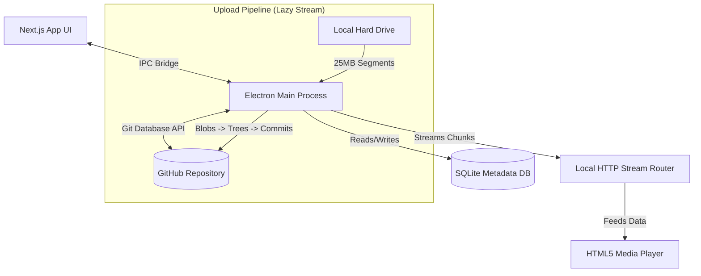

# ☁️ GitHub Drive: Infinite Cloud Storage Interface

Welcome to **GitHub Drive**, an incredibly sophisticated and localized desktop application that bridges the beautiful interface of Google Drive with the limitless backend storage potential of GitHub's version control system.

Built using **Electron, Next.js 16, TypeScript, Better-SQLite3, and Shadcn UI**, this application transforms any standard GitHub repository into a high-capacity, distributed, streaming-capable cloud drive.

## 🚀 Key Features

### 1. The GitHub "Git Database" Backbone
Unlike generic GitHub wrappers that use basic file-upload APIs, GitHub Drive communicates directly via the low-level **Git Database API** (Trees, Blobs, and Commits). 
* **Atomic Uploads:** Complex folder structures and file overrides are handled sequentially as "Git Commits", completely nullifying edge-case crashes related to simultaneous caching or API rate limits.
* **Intelligent File Chunking:** GitHub strictly limits file sizes to 25MB via the API. To bypass this, massive files (e.g., 500MB videos or 1GB ZIP archives) are automatically swept up, mathematically split into 25MB chunks (`video.mp4.001`, `video.mp4.002`, etc.), encrypted, and uploaded asynchronously. 
* **Absolute Collision Prevention:** Files are assigned mathematically unique UUIDs inside the SQLite core when they are uploaded. This physically separates files inside GitHub's "flat" cloud storage layer. You can have 50 files named `report.pdf` in 50 different folders without them ever overwriting each other.

### 2. High-Performance Lazy Stream Architecture
Traditional applications load massive files into your computer's RAM (memory) before attempting to encrypt or upload them. That limits your upload capacity to the amount of RAM in your computer. 
* **Zero-Footprint Uploads:** GitHub Drive uses an advanced "Lazy Stream Pipeline". If you drag-and-drop a 5GB file into the app, it pulls directly from your hard drive exactly 25MB at a time, uploads it, and deletes the 25MB slice from memory. No freezing, no crashing, no matter how big the file!

### 3. Integrated Video & Media Streaming 
When you click on a massive movie file inside the UI, it does *not* download the whole file to your computer.
Instead, a local HTTP stream server boots up securely inside Electron inside your computer. When you "scrub" (skip ahead) on the media player, it mathematically calculates exactly which 25MB chunks on GitHub contain that timestamp and dynamically pulls those exact blocks directly via GitHub's Raw CDN! You can instantly stream 4K movies hosted entirely on a GitHub repository.

### 4. Sleek, "Premium" Google Drive Aesthetics
Engineered with Shadcn UI (v4 / Base UI) and Tailwind CSS, the application features an enterprise-grade dark mode, glassmorphic dropdowns, contextual right-click menus, dynamic file tracking, and real-time nested folder navigation.

---

## 🛠 Required Setup & Configuration

### Prerequisites
* Node.js (v18 or higher)
* A GitHub Account

### 1. Create a GitHub App
Because you are accessing repository files via the low-level Git Database API, the application requires a secure, fine-grained **GitHub App** registration:
1. Go to your GitHub Settings -> Developer settings -> **GitHub Apps** -> **New GitHub App**.
2. **Basic Settings**: 
   - **GitHub App Name**: Anything unique (e.g., `Infinite-Drive-YourName`).
   - **Homepage URL**: `http://localhost`.
3. **Permissions** (Expand **Repository permissions**):
   - **Contents**: Select **Read & write** (This is mandatory for uploads).
   - **Metadata**: This will be automatically set to **Read-only**.
4. **User permissions**: No changes needed.
5. **Install App**: 
   - Ensure "Any account" or "Only on this account" is checked, then click **Create GitHub App**.
6. **Enable Device Flow** (Crucial!):
   - On the left sidebar, click **Identification and Authorization**.
   - Check the box for **"Enable Device Flow"**.
7. **Install for Storage**:
   - Go to **Install App** in the left sidebar.
   - Click **Install** next to your profile.
   - Select **Only select repositories** and pick your "Storage Repository" (created in Step 2).
8. **Client ID**: Copy your **Client ID** from the "General" tab and keep it handy.

### 2. Create a Storage Repository
Create an empty, **private** repository on your GitHub account where your physical file chunks will be stored.
For example: `https://github.com/YourUsername/MyCloudDrive`

### 3. Launch the Application
Clone this project, then run the standard installation and boot commands:

```bash
# 1. Install dependencies (This also executes native Node module compilation for Electron SQLite3!)
npm install

# 2. Boot the Next.js React frontend AND the Electron backend concurrently 
npm run dev
```

### 4. Connect GitHub
Once the beautiful UI loads up:
1. Click **Settings** (the gear icon) in the bottom-left corner of the Sidebar.
2. Enter your GitHub **Client ID**.
3. Enter your **Repository Owner** (your username) and **Repository Name** (the repo you just made).
4. Enter the internal branch you want files stored on (usually `main`). 
5. Click **Sign In**. The app will provide a secure 8-digit device code. Click the pop-up link to securely authorize the app on the GitHub Website.

You are now fully connected to the Infinite Drive!

---

## 🏗 System Architecture Diagram



### 🗄 Where are my files and database saved locally?
The application gracefully saves all local configuration variables and the all-important **SQLite Database** (`github-drive.db`) completely outside of the project folder using Electron's secure `userData` system API. You can find your database here:
* **Windows:** `C:\Users\<YourUsername>\AppData\Roaming\github-drive\github-drive.db`
* **macOS:** `~/Library/Application Support/github-drive/github-drive.db`
* **Linux:** `~/.config/github-drive/github-drive.db`

## 🐛 Troubleshooting

* **I am getting a `SqliteError` in my terminal:**
   * This means your Node Native Modules haven't completely bound to Electron's version. Run `npm run postinstall` to manually trigger `electron-builder`'s dependency compiler!
* **I'm getting a `401 Bad Credentials` Error:**
   * Your GitHub OAuth token has expired (or was manually revoked by you). Simply open the Settings dialog in the app and click **Sign In** again to generate a new valid 8-hour token!
* **I'm getting a `404 Not Found` when trying to view files inside the UI:**
   * Double-check your GitHub repository name and owner in the Settings menu ensure you didn't accidentally include typos or extra spaces!
